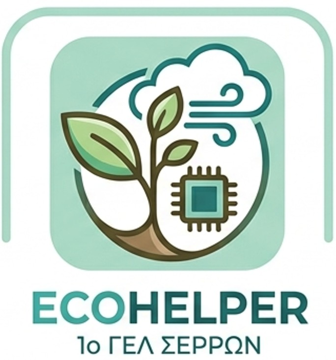

# Εισαγωγή

Διαδραστικό ρομπότ-βοηθός που συλλέγει καθημερινά δεδομένα για τον καιρό, γεγονός που του δίνει τη δυνατότητα να διεξάγει μακροχρόνιες μελέτες για τη μεταβολή του μικροκλίματος της περιοχής. Με βάση αυτά τα δεδομένα θα παίρνει, επίσης, αποφάσεις για την φροντίδα των φυτών που διαθέτουμε στο σπίτι. Τέλος, μέσω κατάλληλης κάμερας θα αναγνωρίζει αντικείμενα τα οποία μπορούν να ανακυκλωθούν.

# Αλληλεπίδραση

Μέσω κατάλληλων αισθητήρων η διάταξη καταγράφει δεδομένα θερμοκρασίας, ατμοσφαιρικής πίεσης και υγρασίας.
Τα δεδομένα αυτά θα είναι ανοιχτά και θα μπορούν να χρησιμοποιηθούν από οποιονδήποτε θέλει να τα μελετήσει / αξιοποιήσει.
Επίσης, θα βοηθήσουν στην μελέτη της μεταβολής των κλιματολογικών συνθηκών της περιοχής του σχολείου μας.
Ταυτόχρονα, θα παρέχει επικαιροποιημένες πληροφορίες φροντίδας των φυτών του σχολείου.
Η κάμερα που διαθέτει θα αναγνωρίζει αντικείμενα που μπορούν να ανακυκλωθούν, βοηθώντας στη διαδικασία ανακύκλωσης.

# Χρήσεις

1. Καταγραφή δεδομένων μικροκλίματος.
2. Δημιουργία βάσης ανοιχτών δεδομένων.
3. Παροχή πληροφοριών φροντίδας φυτών.
4. Αναγνώριση αντικειμένων που μπορούν να ανακυκλωθούν.

# Τεχνολογική υλοποίηση

- Γλώσσα Προγραμματισμού: Python

# Υλικά

- Raspberry Pi 4/5 ως “εγκέφαλος” της διάταξης.
- Κάμερα HuskyLens με ενσωματωμένη τεχνητή νοημοσύνη για ανάλυση εικόνας και αναγνώριση αντικειμένων.
- Οθόνη για την εμφάνιση πληροφοριών.
- module αποθήκευσης δεδομένων.
- 3D printed εξαρτήματα για το σώμα του ρομπότ.

Τέταρτο και εξαιρετικό project! Το **EcoHelper** είναι ένας ολοκληρωμένος ψηφιακός βοηθός για το περιβάλλον, ο οποίος συνδυάζει ιδανικά το Internet of Things (IoT) για τη συλλογή κλιματικών δεδομένων, την Τεχνητή Νοημοσύνη (Edge AI) για την ανακύκλωση και την ανοιχτή φιλοσοφία των open data.

Με βάση τις σημειώσεις του αρχείου σου, ακολουθεί η διαμόρφωση των δύο τελευταίων πεδίων για τη φόρμα της ΕΛΛΑΚ:

# Πορεία Υλοποίησης

Η ανάπτυξη του διαδραστικού ρομπότ **EcoHelper** οργανώθηκε και υλοποιήθηκε σε τέσσερις διακριτές φάσεις:

1. **Σχεδιασμός και Συναρμολόγηση Υλικού (Hardware):**
* Πραγματοποιήθηκε ο τρισδιάστατος σχεδιασμός (3D Modeling) του σώματος του ρομπότ, με πρόβλεψη για ειδικές εσοχές για τους αισθητήρες, την οθόνη και την κάμερα. Τα εξαρτήματα εκτυπώθηκαν σε 3D printer.

* Συναρμολογήθηκε η διάταξη με κεντρικό υπολογιστή το **Raspberry Pi**, στον οποίο συνδέθηκαν η **AI κάμερα HuskyLens**, η οθόνη ενδείξεων, το module αποθήκευσης και οι αισθητήρες περιβάλλοντος (θερμοκρασίας, υγρασίας, ατμοσφαιρικής πίεσης).

2. **Ανάπτυξη Λογισμικού και Διαχείριση Δεδομένων (Software & IoT):**
* Αναπτύχθηκε κώδικας σε γλώσσα **Python** για την αυτόματη λήψη μετρήσεων από τους αισθητήρες σε τακτά χρονικά διαστήματα.

* Σχεδιάστηκε η δομή της βάσης δεδομένων στο module αποθήκευσης για την τοπική καταγραφή των κλιματικών δεικτών, και υλοποιήθηκε η διαδικασία εξαγωγής τους σε ανοιχτά πρότυπα (π.χ. αρχεία .csv), ώστε να είναι εύκολα προσβάσιμα για μελέτη.

* Ενσωματώθηκε ο αλγόριθμος λήψης αποφάσεων (decision-making) για τη φροντίδα των φυτών, ο οποίος συγκρίνει τις live μετρήσεις (π.χ. χαμηλή υγρασία) με τις ιδανικές συνθήκες των φυτών του σχολείου, παράγοντας αντίστοιχες ειδοποιήσεις στην οθόνη.

3. **Εκπαίδευση Μοντέλου AI για Ανακύκλωση (Computer Vision):**
* Πραγματοποιήθηκε η εκπαίδευση της κάμερας HuskyLens μέσω μηχανικής μάθησης για την αναγνώριση διαφορετικών κατηγοριών αντικειμένων καθημερινής χρήσης (π.χ. πλαστικά μπουκάλια, αλουμινένια κουτάκια, χαρτί).

* Ορίστηκε η ροή αλληλεπίδρασης, ώστε όταν ένας χρήστης δείχνει ένα αντικείμενο στην κάμερα, το ρομπότ να αναγνωρίζει αν είναι ανακυκλώσιμο και να εμφανίζει στην οθόνη οδηγίες για τη σωστή διαλογή του.

4. **Έλεγχος και Δοκιμές (Testing):**
* Έγιναν δοκιμές βαθμονόμησης (calibration) των αισθητήρων για τη διασφάλιση της ακρίβειας των μετεωρολογικών δεδομένων.

* Πραγματοποιήθηκαν δοκιμές στην AI κάμερα για τη βελτιστοποίηση του ποσοστού επιτυχούς αναγνώρισης των απορριμμάτων.

# Αποτίμηση

Το project **EcoHelper** ολοκληρώθηκε με επιτυχία, αποτελώντας ένα εξαιρετικό παράδειγμα πρακτικής εφαρμογής των ανοιχτών τεχνολογιών στην περιβαλλοντική εκπαίδευση:

* **Λειτουργική Αποτελεσματικότητα:** Το ρομπότ ανταποκρίνεται πλήρως στις προδιαγραφές του. Καταγράφει με ακρίβεια το μικροκλίμα, παρέχει χρήσιμες συμβουλές για τη σχολική χλωρίδα και αναγνωρίζει αξιόπιστα τα ανακυκλώσιμα υλικά μέσω Edge AI, χωρίς να απαιτείται σύνδεση στο διαδίκτυο για την επεξεργασία της εικόνας.

* **Κοινωνικός και Οικολογικός Αντίκτυπος:** Η δημιουργία μιας τοπικής, ανοιχτής βάσης δεδομένων προσφέρει πολύτιμο υλικό για τη μελέτη της κλιματικής αλλαγής σε επίπεδο μικροκλίματος. Παράλληλα, το ρομπότ λειτουργεί ως ένας διαδραστικός εκπαιδευτικός βοηθός που ευαισθητοποιεί τη σχολική κοινότητα γύρω από την ανακύκλωση και την προστασία του περιβάλλοντος.

* **Παιδαγωγική Αξία:** Η ομάδα των μαθητών εμβάθυνε στον κόσμο της επιστήμης των δεδομένων (Data Science), της χρήσης αισθητήρων (IoT) και της οικολογικής σχεδίασης, κατανοώντας πώς η τεχνολογία μπορεί να τεθεί στην υπηρεσία του πλανήτη.

* **Ανοιχτή Φιλοσοφία & Αναπαραγωγιμότητα:** Όπως επιτάσσουν οι αρχές της ΕΛΛΑΚ, ο κώδικας (Python), τα 3D σχέδια και τα δεδομένα των μετρήσεων θα είναι πλήρως ανοιχτά στο κοινό. Το έργο είναι εξαιρετικά βιώσιμο και μπορεί εύκολα να αναπαραχθεί από οποιοδήποτε άλλο σχολείο επιθυμεί να δημιουργήσει τον δικό του σταθμό περιβαλλοντικής παρακολούθησης.

